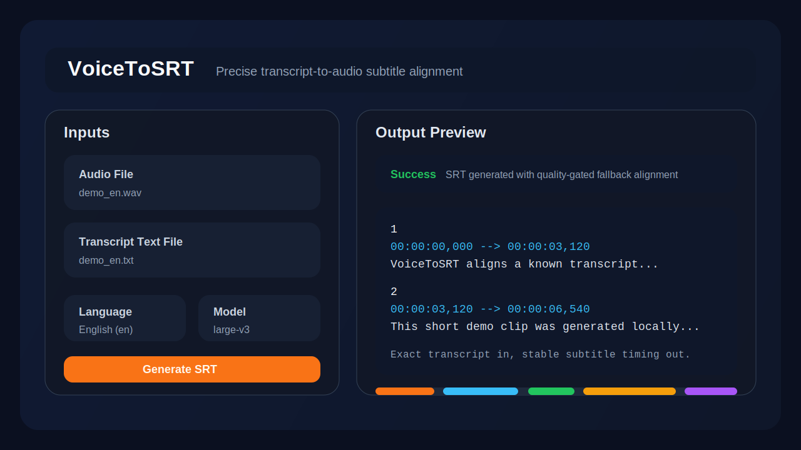

# VoiceToSRT

VoiceToSRT aligns a known transcript to spoken audio and exports a subtitle file in `.srt` format. It is designed for cases where you already have the exact script, for example TTS-generated audio, dubbed narration, or a verified translation.



## Why this project exists

Most subtitle tools start from speech recognition alone. That works for rough captions, but it is weaker when you already know the exact text and want tighter subtitle timing.

VoiceToSRT takes a different approach:

- It first tries forced alignment with `stable-ts` / Whisper.
- It keeps your transcript split by line, so each text line becomes one subtitle block.
- If direct alignment quality is poor, it falls back to a global character-to-timestamp mapping strategy that preserves order and avoids the common "everything gets pushed to the end" failure mode.

## Features

- Gradio GUI for drag-and-drop usage
- CLI mode for scripting and batch runs
- Model selection in the GUI: `base`, `small`, `medium`, `large-v2`, `large-v3`
- GUI language shortcuts for `Auto`, Korean, Japanese, Chinese, English, and German
- Forced alignment quality checks before writing output
- Robust fallback alignment when forced alignment becomes unstable
- Windows and macOS launcher scripts

## How it works

1. Read the transcript file and keep non-empty lines as subtitle blocks.
2. Run Whisper-based forced alignment with `stable-ts`.
3. Check the returned timestamps for zero-duration blocks, large gaps, and end-of-file collapse.
4. Retry with grouped alignment if line-level alignment is weak.
5. Fall back to Whisper transcription plus a global character map when direct alignment still fails.
6. Export a standard `.srt` file.

This hybrid approach is especially useful for multilingual TTS workflows where the transcript is exact but line-level forced alignment can still drift.

## Requirements

- Python 3.10+
- `ffmpeg` available in `PATH`
- A machine that can run Whisper models
- For best accuracy, use `large-v3` when your hardware can handle it

## Installation

```bash
python3 -m venv .venv
source .venv/bin/activate
pip install -r requirements.txt
```

Install `ffmpeg` before running the app.

Examples:

- macOS: `brew install ffmpeg`
- Ubuntu/Debian: `sudo apt-get install ffmpeg`
- Windows: install FFmpeg and add it to `PATH`

## Quick start: GUI

### macOS / Linux

```bash
./run_gui.sh
```

The launcher will use:

- `$PYTHON_EXEC` if you set it
- `/opt/miniconda3/bin/python3` if it exists
- otherwise `python3` or `python`

### Windows

Activate your Python environment first, then run:

```bat
run_gui.bat
```

Open the local Gradio page, upload:

- one audio file such as `.mp3` or `.wav`
- one transcript file in `.txt`

Then choose the language and model, and click **Generate SRT**.

## Command line usage

```bash
python app.py \
  --audio "path/to/audio.mp3" \
  --text "path/to/transcript.txt" \
  --output "path/to/output.srt" \
  --language "ja" \
  --model "large-v3"
```

Arguments:

- `--audio`: input audio file
- `--text`: transcript text file
- `--output`: output subtitle path
- `--language`: Whisper language code such as `ko`, `ja`, `zh`, `en`, `de`
- `--model`: Whisper model name

The CLI accepts any Whisper language code. The GUI exposes a curated list of common options.

## Public demo assets

This repository includes a small public demo in [`examples/`](examples):

- [`examples/demo_en.wav`](examples/demo_en.wav)
- [`examples/demo_en.txt`](examples/demo_en.txt)
- [`examples/demo_en.srt`](examples/demo_en.srt)

The audio was generated locally from original text so the repository does not depend on private or copyrighted sample material.

## Project layout

- [`app.py`](app.py): CLI entry point
- [`gui.py`](gui.py): Gradio interface
- [`backend.py`](backend.py): alignment logic
- [`run_gui.sh`](run_gui.sh): macOS/Linux launcher
- [`run_gui.bat`](run_gui.bat): Windows launcher
- [`examples/`](examples): public demo assets
- [`docs/`](docs): README assets

## Model notes

- `base` is fast and works well for quick checks.
- `large-v3` usually gives the best alignment quality, but needs more RAM and CPU/GPU time.
- Even with exact TTS transcripts, forced alignment can fail on very short lines or dense multilingual content. That is why this project includes a quality-gated fallback path.

## Troubleshooting

### The GUI starts but alignment quality is poor

- Try `large-v3`
- Choose the language explicitly instead of `Auto`
- Make transcript lines slightly longer instead of splitting every short phrase into its own line

### The app cannot find Python

- Set `PYTHON_EXEC` before running `run_gui.sh`
- or activate a virtual environment and ensure `python3` is available

### OpenMP errors on macOS

The launcher scripts export conservative OpenMP settings to reduce duplicate runtime crashes.

## CI

The repository includes a minimal GitHub Actions workflow that checks:

- Python files compile successfully
- `run_gui.sh` passes `bash -n`

This keeps the public repo from drifting into obvious syntax breakage without forcing heavyweight model downloads in CI.

## License

This project is released under the [MIT License](LICENSE).
